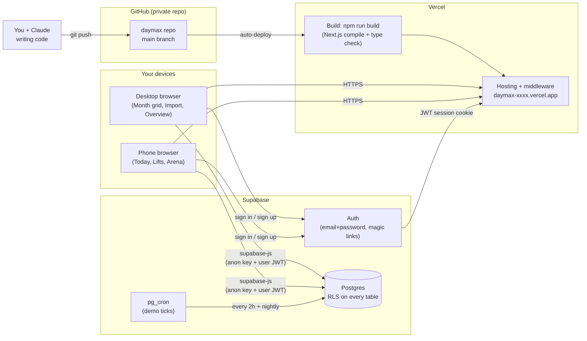
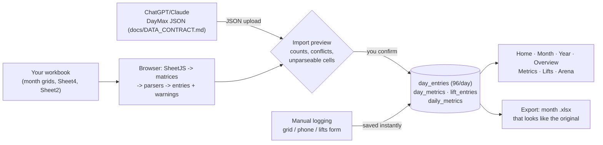
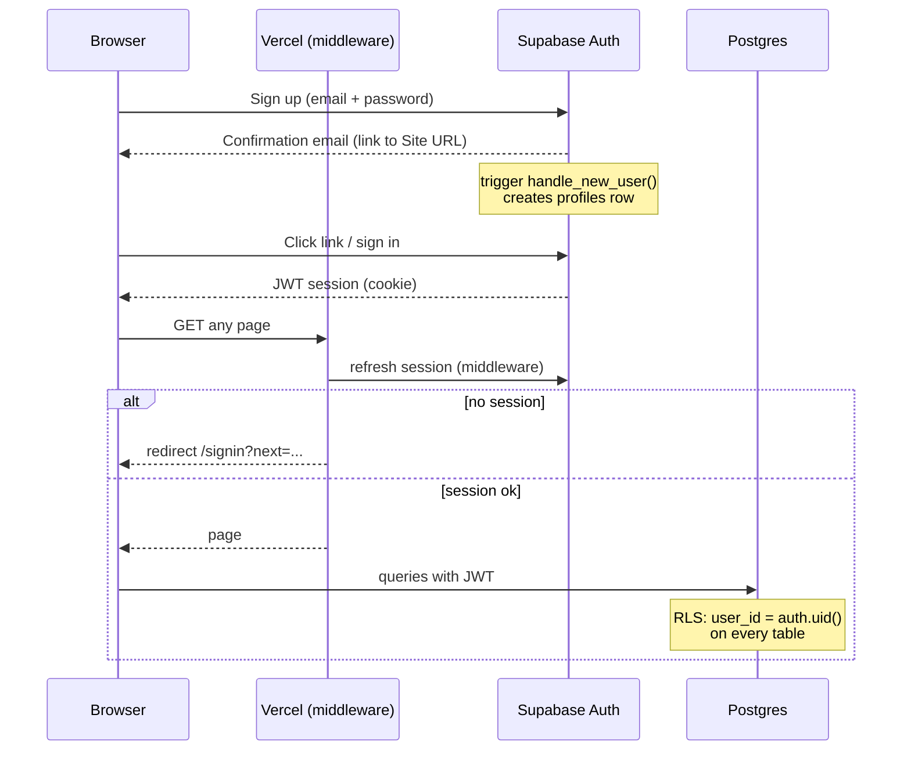
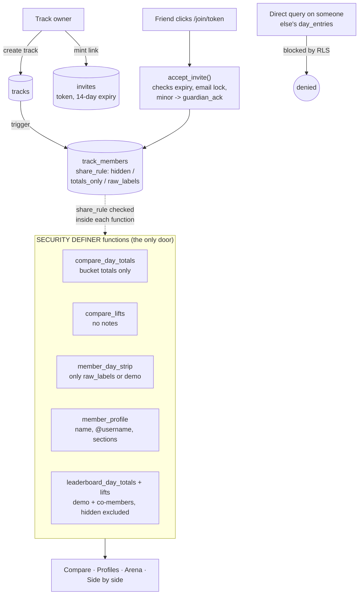
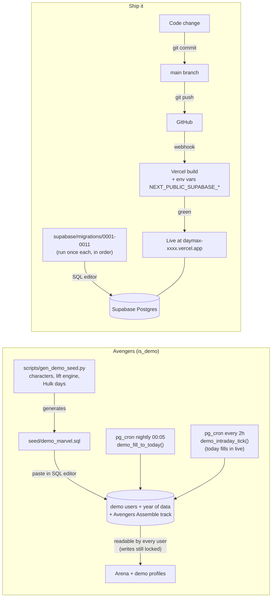

# DayMax — System Map

Six diagrams describing how DayMax works end to end: browser, Vercel, Supabase, the repo's internals, data flow, auth, privacy enforcement, and the demo/deploy pipeline.

> Mermaid diagrams — GitHub renders these automatically. Any AI can read the source or re-render it. The interactive version is `docs/SYSTEM_MAP.html`.

## 1. The big picture

Who talks to whom. The browser does almost all the work; Vercel serves the app; Supabase holds the data and enforces every rule.

## 2. Repo anatomy — script to script

Pages are thin; all logic lives in src/lib. Pure logic (parsers, stats) has no dependencies so it's unit-testable.

```mermaid
flowchart TD
  subgraph pages["src/app (pages)"]
    home["/ Home<br/>score cards, life-in-weeks"]
    month["/day Month grid"]
    year["/year Year heatmap + strips"]
    today["/today Phone editor"]
    lifts["/lifts Log + goals + progression"]
    metricspg["/metrics Edit day metrics"]
    overview["/overview Custom analytics"]
    friendspg["/friends Tracks, invites, compare"]
    profile["/friends/[id] Profiles"]
    arena["/arena + /arena/compare"]
    importpg["/import"]
    exportpg["/export"]
    settings["/settings"]
    join["/join/[token]"]
    signin["/signin + /auth/callback"]
  end
  subgraph lib["src/lib (logic)"]
    data["data.ts<br/>my data CRUD (paged)"]
    friends["friends.ts<br/>tracks/invites/compare via RPC (rpcAll)"]
    ranking["ranking.ts<br/>buckets, focus score"]
    stats["stats.ts<br/>Pearson r, period aggregation"]
    parsers["gridParse / liftParse / sheet2Parse<br/>(pure, unit-tested)"]
    xlsxio["xlsxIO.ts<br/>SheetJS in browser only"]
    lifelib["life.ts<br/>life expectancy math"]
    themelib["theme.ts<br/>themes, bucket colours (localStorage)"]
    supa["supabase/client.ts + server.ts<br/>+ middleware.ts (session)"]
  end
  home & overview & arena --> ranking & stats
  month & today & year --> data
  lifts & metricspg --> data
  importpg & exportpg --> xlsxio --> parsers
  friendspg & profile & arena & join --> friends
  home & settings --> lifelib
  pages --> themelib
  data & friends --> supa
```

## 3. How your data gets in and out

Two ways in, one home, Excel round-trip out. Nothing is saved from an import without the preview step.

## 4. Auth — sign up to session

## 5. Friends & Compare — where privacy is enforced

The client never reads another user's tables (RLS makes it impossible). Everything social flows through SQL functions that check membership and share rules inside the database.

## 6. The demo universe & deploy pipeline

